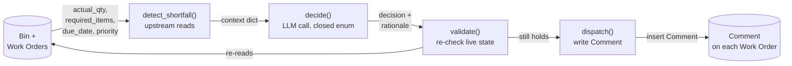

# The Disruption-Response Agent — Pipeline Reference

This document explains how `disruption_response.py` works end to end: what it
reads, where the LLM sits, and why each boundary around it is drawn where it
is. It's written for anyone picking up this codebase with no prior context —
a student, a supervisor, or a future contributor.

## What problem this solves

Two Work Orders can compete for the same scarce raw material. When that
happens, *someone* has to decide which one gets it first — a judgment call
that depends on due dates, priority, and how much each order actually needs,
none of which reduces to a single sortable number. This agent makes that one
call, on a fixed, narrow footing: it never decides *whether* a shortfall
exists (that's a deterministic arithmetic check), and it never *acts* beyond
writing its reasoning down for a human to read.

## Prerequisites

- A running ERPNext instance (`frappe_docker`, `http://localhost:8080` by
  default) with at least one raw material item, two or more open Work Orders
  drawing on it, and the `custom_priority` Custom Field installed
  (`Omron_PLC_AI/erp_schema/custom_fields/Work Order-custom_priority.json`,
  applied via `schema_sync.py apply`).
- API credentials for at least one LLM provider (`GEMINI_API_KEY` or
  `OLLAMA_API_KEY`) in a `.env` file — see `.env.example`.
- `pip install -r requirements.txt`.

## The pipeline, stage by stage

### 1. `detect_shortfall(client)` — upstream, pure reads

Reads the raw material's current `Bin.actual_qty`, then every open Work
Order's `required_items`, `expected_delivery_date`, and `custom_priority`.
Sums total demand against available stock. Returns `None` if there's no
shortfall — this is a plain `if` comparison, not a judgment call, and the LLM
is never invoked when it doesn't need to be.

If there **is** a shortfall, it returns a context dict: for each competing
Work Order, `qty_needed`, `due_date`, `priority` — plus the shared
`available_qty` and `total_needed_qty`. This dict is the entire world the LLM
gets to see.

### 2. `decide(shortfall)` — the one LLM call, output-constrained

Builds a JSON schema whose `decision` field is a closed enum: the actual
candidate Work Order names, plus `escalate_to_human`. No free text, no
open-ended action. Calls the LLM via `llm_providers.call(provider, prompt,
schema)`; the provider is one of two, selected by the `LLM_PROVIDER` env var:

- `gemini` — `google.genai`, schema enforced server-side via
  `response_json_schema`.
- `ollama` — GLM 5.3 (or another model) via Ollama Cloud. **Ollama Cloud does
  not enforce structured output server-side for any hosted model** (verified
  against three different vendors' models, not assumed) — so the schema is
  embedded in the prompt text instead, and the response is parsed leniently
  by `llm_providers.extract_json()`.

Either way, if the response can't be parsed, or the parsed decision isn't
actually one of the allowed values, `decide()` escalates to a human instead
of guessing or crashing.

### 3. `validate(client, shortfall, decision)` — re-check before acting

Re-runs `detect_shortfall()` against **live** state immediately before
writing anything. If the shortfall has already been resolved by the time the
LLM answered (someone restocked, an order was cancelled), the write doesn't
happen. This exists because the LLM call isn't instantaneous, and ERPNext
state isn't frozen while it thinks.

### 4. `dispatch(client, shortfall, decision)` — downstream, the only write

Inserts a `Comment` on every Work Order involved, tagged with which provider
actually answered (e.g. `[disruption_response - Gemini]`). **This is the only
side effect the agent ever produces.** It does not change a Work Order's
quantity, due date, or priority, and it does not touch stock. A human reads
the comment and decides what to actually do about it.

## Two things that will look like bugs and aren't

- **`Comment` doctype, not `frappe.client.add_comment`.** That method doesn't
  exist on this ERPNext version — comments are written by inserting the
  `Comment` doctype directly (`reference_doctype`, `reference_name`,
  `content`).
- **`allow_on_submit: 1` is what makes `custom_priority` writable on an
  already-submitted Work Order at all.** ERPNext locks most fields once a
  document is submitted; without this flag on the Custom Field definition,
  every write from this agent (and from `fabricate_lines.py`) would silently
  fail or reject.

## File map

| File | Role |
|---|---|
| `disruption_response.py` | The four-stage pipeline above, plus `run_once()` wiring them together |
| `llm_providers.py` | Provider abstraction — `call_gemini`, `call_ollama_cloud`, `extract_json`, dispatched via `call(provider, ...)` |
| `erp_common/builders.py` | Constructs ERPNext doctype dicts (Work Order, Stock Reconciliation) — no I/O |
| `erp_common/plumbing.py` | Thin wrappers around `erp_client` for insert/submit/update |
| `Omron_PLC_AI/erp_client.py` | The actual ERPNext REST client, credential loading (`ERP_CONFIG_PATH`-aware) |
| `Omron_PLC_AI/schema_sync.py` | Tracks and applies the `custom_priority` Custom Field (and other custom schema) as version-controlled JSON |
| `fabricated_workstations/fabricate_lines.py` | Builds the scarcity/due-date/priority scenario this agent reasons over |
